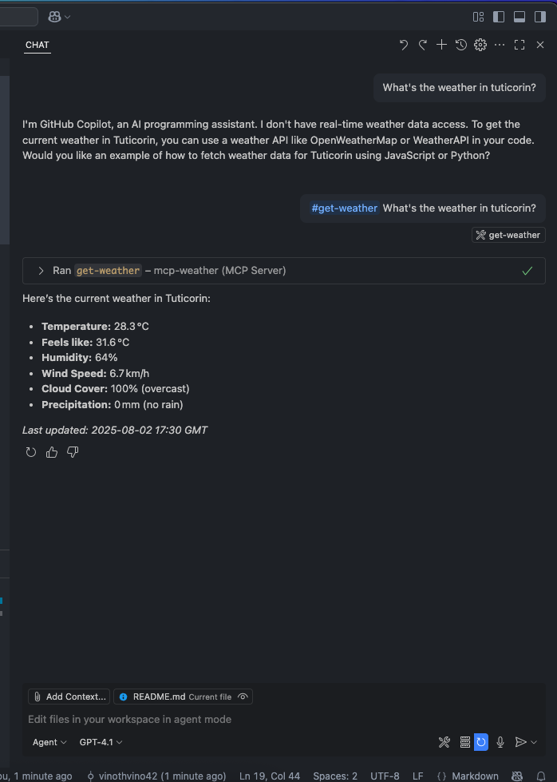

# MCP Weather

MCP Weather is a Model Context Protocol (MCP) server that provides current weather information for any city. It exposes an API endpoint to fetch real-time weather data by city location.

## Features

- 🌤️ Fetches current weather data by city name
- 🌡️ Returns temperature, humidity, wind speed, cloud cover, and precipitation



## Getting Started

### Prerequisites

- Node.js (v18 or above recommended)
- npm or yarn

### Installation

Clone the repository and install dependencies:

```bash
git clone https://github.com/vinothvino42/mcp-weather.git
cd mcp-weather
npm install
```

### Running the Server

```bash
npm run build
npm run inspect # To inspect it with MCP Inspector
```

## API Usage

### Tools

- `get-weather`
  - Prompt must include the city name

**Prompt:**

```
What's the weather in tuticorin?
```

**Response:**

```
Here’s the current weather in Tuticorin:

- Temperature: 28.3 °C
- Feels like: 31.6 °C
- Humidity: 64%
- Wind Speed: 6.7 km/h
- Cloud Cover: 100% (overcast)
- Precipitation: 0 mm (no rain)
```
